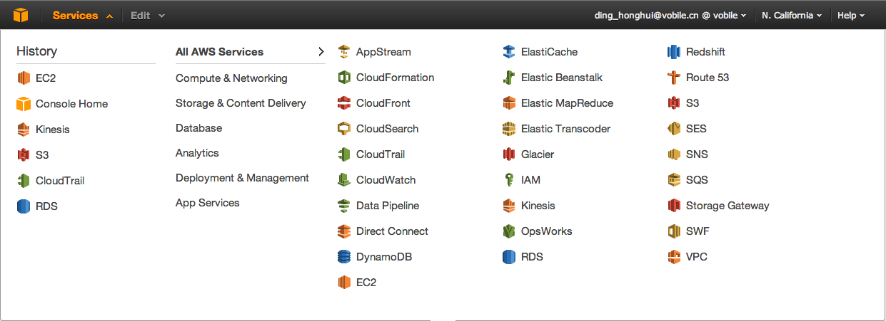
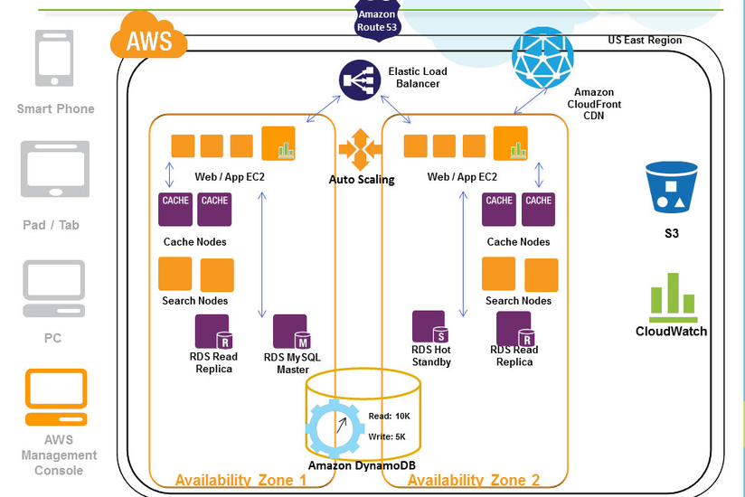

% Amazon AWS 以及 OpenStack 介绍
% Honghui Ding <hhding.gnu at gmail.com>
% 2014-03-22

# Agenda

1. 什么是云(Cloud)
2. Amazon AWS 介绍
3. OpenStack 介绍

# 什么是云？

* 是云里雾里？
* 资源的管理和分割和抽象
  * CPU，内存，磁盘，网络等
* 按需分配，随时回收，按使用量收费

# AWS 介绍
* Amazon Web Services offers reliable, scalable, and inexpensive cloud computing services. Free to join, pay only for what you use.

# AWS 由什么组成？
 

# AWS 典型表现
 

# AWS 的常见的几个术语
* EC2
* ELB
* EBS
* AutoScaling
* CloudWatch
* CloudFront
* RDS
* S3
* Glacier

# Amazon AWS 操作界面
* 命令行
* Web Console
* API
* python boto 库演示

# OpenStack 介绍
* OpenStack Software delivers a massively scalable cloud operating system.
* 

# OpenStack 逻辑组成
* nova-compute
* nova-network
* nova-volume
* keystone
* glance

# 逻辑组成
 

# 演示时间

# End

Thanks

