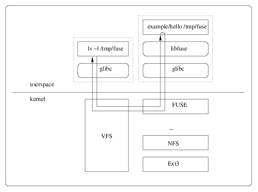

% Write Your Own Filesystem in 15 Minutes
% Honghui Ding <hhding.gnu at gmail.com>
% 2014-04-30

#### Agenda
- What is a filesystem
- What is VFS
- What is FUSE
- Demo
- Interesting Projects depends on FUSE

#### What is filesystem
- Ext3/Ext4/XFS
- NFS
- CIFS
- ZFS
- procfs/sysfs/debugfs

#### What is VFS

#### What is VFS
- 文件系统的抽象接口
- 文件系统的一些通用的实现
- 其他文件系统需要注册到 VFS 才能使用

#### What is FUSE
- Filesystem in USErspace
- With FUSE it is possible to implement a fully functional filesystem in a userspace program.
- *FUSE使得文件系统的实现放在了用户空间*

#### What is FUSE - How it works

#### Demo
- Hello World demo in C
- 2 Way write demo in python
- Read webpage from remote in python

#### Interesting Projects depends on FUSE
- lessfs - data deduplication for less
- zfs-fuse - ZFS on FUSE
- sshfs - filesystem client based on SSH File Transfer Protocol
- curlftpfs - filesystem to access FTP hosts based on FUSE and cURL

#### Q&A

- Thanks
