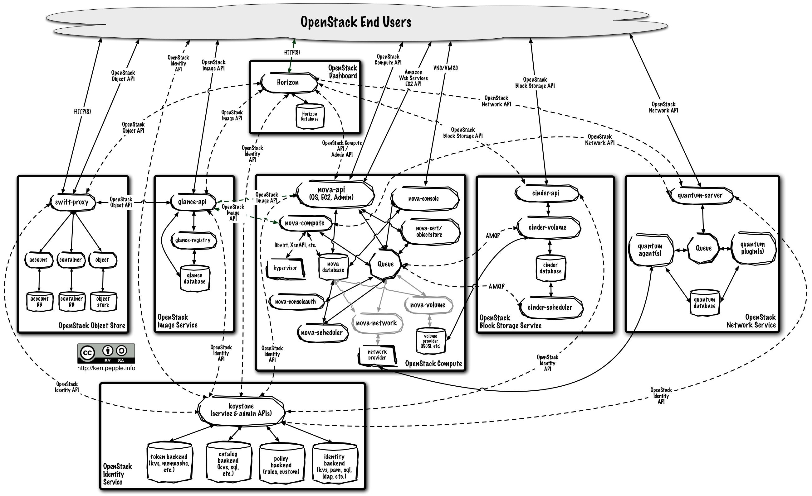

% OpenStack 介绍
% Honghui Ding <hhding.gnu at gmail.com>
% 2014-03-22

# Agenda

1. 什么是云(Cloud)
2. OpenStack 介绍

# 什么是云？

* 资源的管理和分割和抽象
  * CPU，内存，磁盘，网络等
* 按需分配，随时回收，按使用量收费

# OpenStack 介绍
* OpenStack Software delivers a massively scalable cloud operating system.
* 

# OpenStack 逻辑组成
* nova-compute
* nova-network
* nova-volume
* keystone
* glance

# 逻辑组成
 

# End

Thanks

