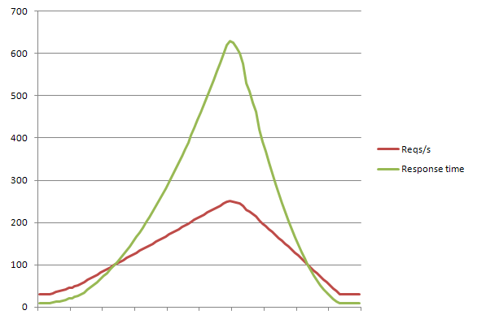

% 存储优化经验分享
% Honghui Ding <hhding.gnu at gmail.com>
% 2014-12-01

#### Agenda
- 引子

#### 引子 - 答案在哪里？
- 众里寻他千百度，蓦然回首，那人却在灯火阑珊处

#### 简单优化阶段(2014/10/11日前)
- 有两个ZFS存储 NAS-02 以及 NAS-05
- NAS-02 存放较新数据，该存储有大量写入和大量随机读取
- NAS-05 存放较老数据，老数据不断进行归档，该存储有批量读取，少有写入
- 线上主要使用新数据，因此对存储 NAS-05 的归档对线上服务影响有限
- 存储系统会将随机写入转为顺序写入
- 存储的压力来自随机读取

#### 首次瓶颈出现(2014/10/11)
- NAS-02 出现瓶颈
- 读取 IOPS 2.4k
- 写入 IOPS 1.2k
- 读写存储失败率很高

#### 解决思路
- 原则：想办法提高性能，保证系统正常运行
- 数据局部性原理
- 最新数据放到一个高性能设备上，分担读取和写入
- 找到一个 SSD 设备，能够存放 3 天的数据
- 通过编写脚本分析日志把数据从后台同步到存储上（前台操作变为后台操作）

#### 实际效果
- 保证了存储写入操作全部成功
- 大大降低了 NAS-02 的压力，提高了其读取性能，同时降低了其 Busy 程度

#### 效果图

#### 瓶颈再现(2014/11/19)
- 数据中心网络故障导致 NAS-02 上有大量数据需要被读取
- 堆积消除要求系统处理量达到现在系统的4倍以上
- NAS-02 的数据成为孤岛数据

#### 解决思路
- 提升 NAS-02 的性能
- 可行吗？其 IO 已经达到满负荷！

#### 收集数据
- 以下这组数据是很粗略的，只供估算
- SSD 设备，约占总访问量25%，读取的 IOPS 约20
- NAS-02，约占总访问量55%，读取 IOPS 推算应该是44
- 单块磁盘的性能约为100 IOPS
- 提升4倍性能需要 NAS-02 提供 1.76 块磁盘的性能(44*4/100 = 1.76)

#### 技术分析
- NAS-02 总共有24块磁盘
- 11块磁盘组成Raid组，总计组成2个组
- 每个Raid组可以提供1块磁盘的性能
- 磁盘的理论性能为2块磁盘(>1.76)能够满足要求

#### 调优 - 消除波动性
- 系统波动性对吞吐量的影响

#### 调优 - 消除波动性
- Haproxy 的秘密

#### 调优- 并发的神话
- 提高并发是不是就会提升处理能力？

#### 调优 - 并发的神话

#### 调优 - 错误的方向
- NFS lock
- NFS atime

#### 调优 - IO 来自哪里？
- IO 来自本机还是网络？
- IO 来自哪个机器？
- IO 来自哪个程序？会不会是 find 程序？

#### 调优 - 扫雷游戏
- 在没有线索的时候，让我们来猜一下

#### 调优 - 我们真的对 NFS 有足够了解吗？
- nfsstat
- 难得遇见小文件如此高频率被读取的场景

#### 调优 - 万能法宝排除法
- 绕过 NFS 会怎样？

#### 效果图

#### 后记
- 已知数据分布，如何评估指定的 SQL 语句会产生多少个 IO？
- 来自 Ted Cui 的一个笔试题

#### Q&A

- Thanks
